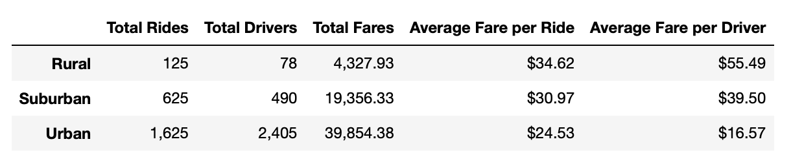
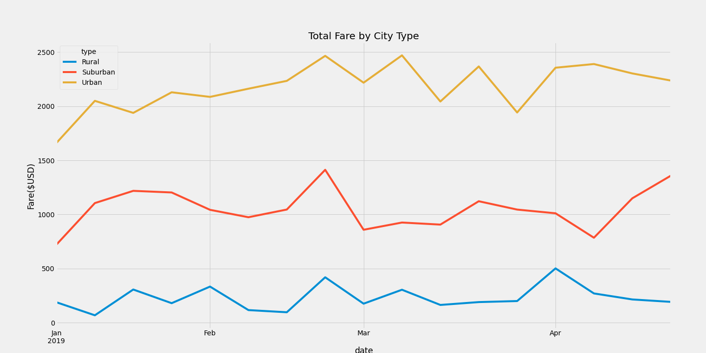

# PyBer_Analysis

## Overview 
 The purpose of this analysis is to create a summary DataFrame of the ride-sharing data by city type(urban, sub urban and rural), and create a multiple-line graph that shows the total weekly fares for each city type. After that, a summary will be drawn to discuss on how the data differs by city type and suggest how to improve the revene by narrow the disparity among those differences.

 ## Results

 

 - Total rides per city type

The number of total rides in rural cities is 13 times and 5 times less than urban and suburban cities respectively. 

- Total drivers per city type

The total number of drivers in rural cities is 3 to 5 times less than urban and suburban cities respectively.  

 - Total fares per city type

The total fares in rural cities is the lowest, 5 to 8 times less than suburban and urban cities respectively. 

-  Average fare per ride

The average fare per ride in rural cities is $34.62 which is the hightest, followed by suburban cities $30.97 and the averge fare in urban cities is the lowest $24.53.

- Average fare per driver

The average fare per driver in rural cities is $55.49, which is the hightest, followed by suburban cities $39.50 and the averge fare per driver in urban cities is the lowest $16.57. The average fare per driver in rural cities is 40% to 235% higher than suburban and urban cities respectively.

 ## Summary

 In the multiple-line graph shows an obviouse disparities of total weekly fares for each city type. The total fares in urban cities is the highest, and never overlaps with suburban and rural. To increase the revenue from suburban and rural, suggestions are as follows:
 
 
 * To increase the number of driver
 The low fares in rural cities might due to lack of drivers, we would suggest to increase the number of driver by referral promotion and credit reward.

* Lower the average fare per ride in rural cities
Another reason of low fares in rural and suburban cities might be because of high riding cost. We would suggest lower the average fare per ride in rural cities, since it is the highest in rural cities. 

* Ride promotion
Apart from lower the average fares, We would suggest introducing ride promotion, which is ride more reward more, to appeal potential passengers to take the ride more often.

 